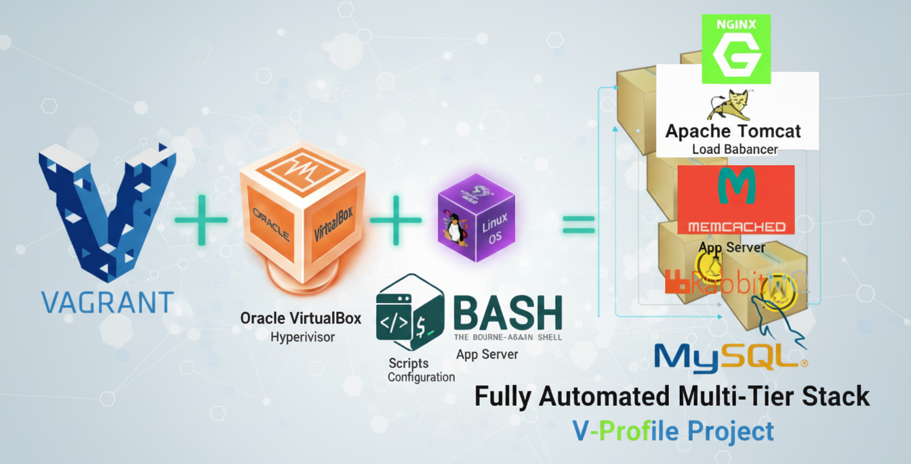

# V-Profile Project: Multi-Tier Java Web Stack

Welcome to the **V-Profile Project**. This repository contains the configuration and automation scripts to set up a multi-tier social networking application locally. 

The goal of this project is to create a repeatable, automated local development environment (Local Lab) using **Infrastructure as Code (IaC)** principles.

---

##  Project Architecture

The application is a distributed system where multiple services work together to provide a seamless user experience.



### Service Stack:
* **Nginx**: Web Service & Load Balancer.
* **Apache Tomcat**: Java Application Server (Hosts the V-Profile Java app).
* **RabbitMQ**: Messaging Broker / Queuing Agent.
* **Memcached**: Database Caching Service.
* **MySQL**: Relational Database Management System.
* **Vagrant & VirtualBox**: For VM automation and management.

---

##  Automated Setup Workflow

Instead of manual installation, we use **Vagrant** to automate the creation and configuration of our Virtual Machines (VMs) on top of Oracle VM VirtualBox.


### Prerequisites
Before starting, ensure you have installed:
1.  **Oracle VM VirtualBox**: The hypervisor to run our VMs.
2.  **Vagrant**: The automation tool to provision the VMs.
3.  **Git Bash**: For executing commands and version control.

---

##  Step-by-Step Implementation

Follow these steps to get your local environment running:

### 1. Clone the Repository
```bash
git clone [https://github.com/your-username/vprofile-project.git](https://github.com/your-username/vprofile-project.git)
cd vprofile-project